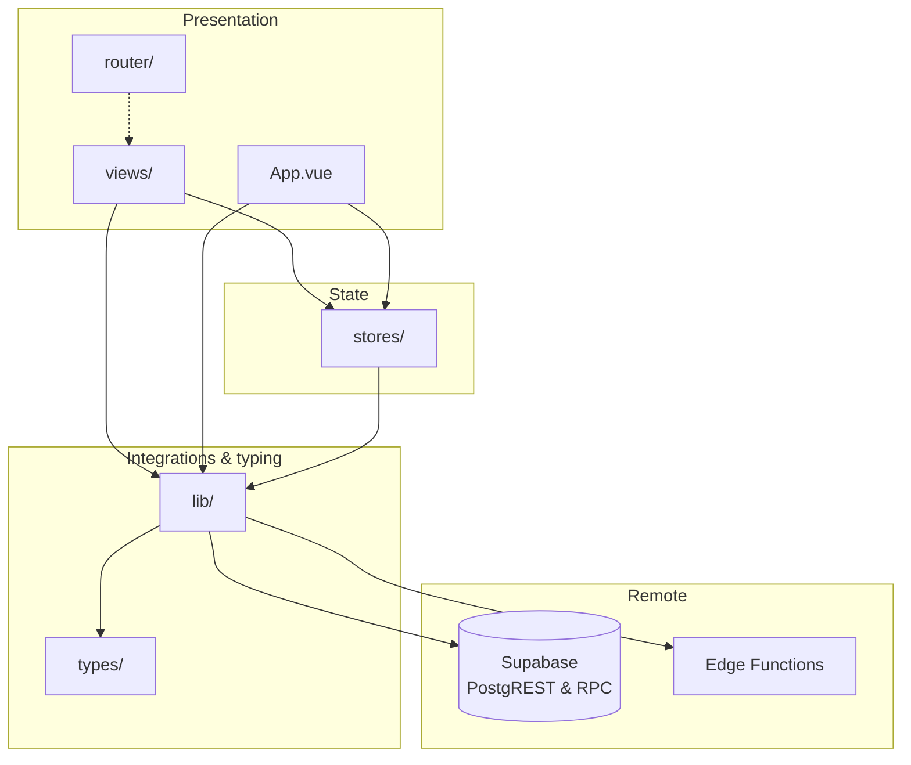

# Architecture

Layers and **where work runs** (browser client vs server). **Trust / authorization**: `docs/security.md`. **Vue/Pinia/router/libs**: `docs/frontend-conventions.md`. **RLS, RBAC, aliases**: `docs/database.md`.

## Layer diagram

Typical dependency flow: UI and routing call into **stores** and **`lib`** helpers; **`lib`** owns the Supabase client and talks to remote services. **`types/`** is shared typing (generated schema + app aliases), not a runtime layer.

- **`src/views/`** — Route-level UI; keep thin. **`InstallAppView.vue`** — public PWA install help (`/install-app`); see **`docs/frontend-conventions.md`**.
- **`src/router/`** — Routes and `meta` only.
- **`src/App.vue`** — Layout; authenticated session lifecycle (bootstrap / clear) lives here—details in `docs/frontend-conventions.md`.
- **`src/lib/`** — Shared integrations: `supabase.ts`, `auth.ts`, `profile.ts`, `admin.ts`, `pwa.ts`.
- **`src/types/`** — `supabase.ts` generated (do not hand-edit); `database.ts` app aliases—see `docs/database.md`.

**Data access**: Single browser client in `src/lib/supabase.ts`, typed with `Database` from `src/types/database.ts`, env `VITE_SUPABASE_URL` and `VITE_SUPABASE_ANON_KEY`. Flow: PostgREST and RPCs under **RLS** where appropriate; work that must not depend on the client alone uses **Edge Functions** (verify caller, then elevated access such as service role).

**ESLint import boundaries**: `@typescript-eslint/no-restricted-imports` blocks `import … from '@/lib/supabase'` outside the integration layer. **Allowed** importers today: `src/lib/auth.ts`, `src/lib/profile.ts`, `src/lib/admin.ts`, plus `src/lib/supabase.ts` itself. Everything else should use `auth` / `profile` / `admin` helpers, Pinia actions, or Edge-backed APIs—not a new direct client import. **When you add a new `src/lib/` module that must use the client**, extend the `ignores` list on the `app/restrict-supabase-client-import` block in `eslint.config.ts` and update this paragraph so the doc and linter stay aligned.

**Decisions**: Two Pinia stores for signed-in UX; route guards must not rely on Pinia alone—**`docs/frontend-conventions.md`**.
